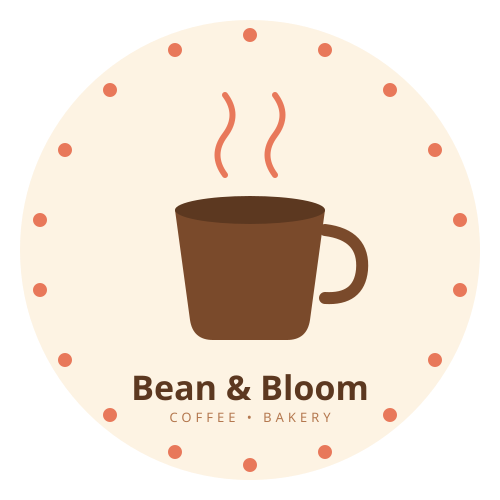
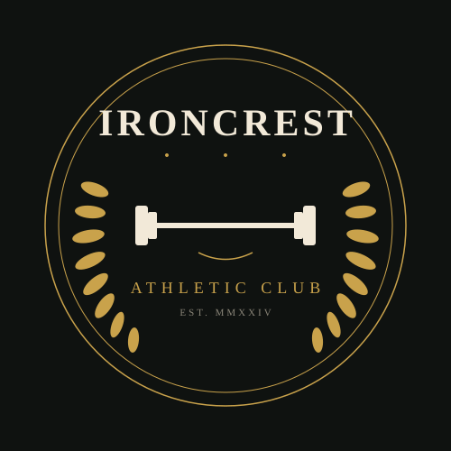
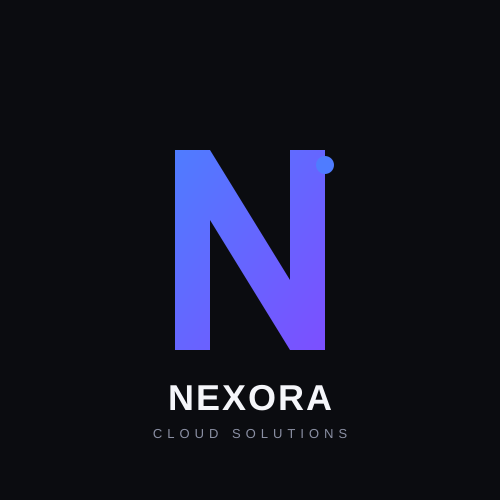

# Logo Design Showcase

A collection of logo concepts designed for client review.

---

## ☕ Bean & Bloom Cafe

  

A warm, playful mark for a coffee & bakery brand — hand-drawn scalloped border, steaming cup, and a soft cream palette.

**Colors:** `#FDF3E3` (cream) · `#7A4A2B` (coffee) · `#E8785A` (terracotta)

---

## 🏋️ Ironcrest Athletic Club

  

A bold, classic emblem for a premium athletic club — laurel wreath, barbell centerpiece, and a dark gold-on-charcoal palette for a heritage feel.

**Colors:** `#0F1210` (charcoal) · `#C9A24B` (gold) · `#F2E9D8` (ivory)

---

## 💻 Nexora Tech

  

A sleek, modern mark for a cloud solutions company — an abstract angular "N" monogram on a deep near-black background, with a blue-to-purple gradient for a tech-forward feel.

**Colors:** `#0B0C10` (near-black) · `#4F7CFF` → `#7C4FFF` (blue-purple gradient) · `#F5F6FA` (off-white)

---

### Notes for Review

- All logos are vector (`.svg`) — fully scalable with no quality loss, from favicon to billboard size.
- Source files are in this repo; open any `.svg` directly for full resolution.
- Let us know which direction(s) you'd like to move forward with, or if you'd like color/style variations on any concept.
